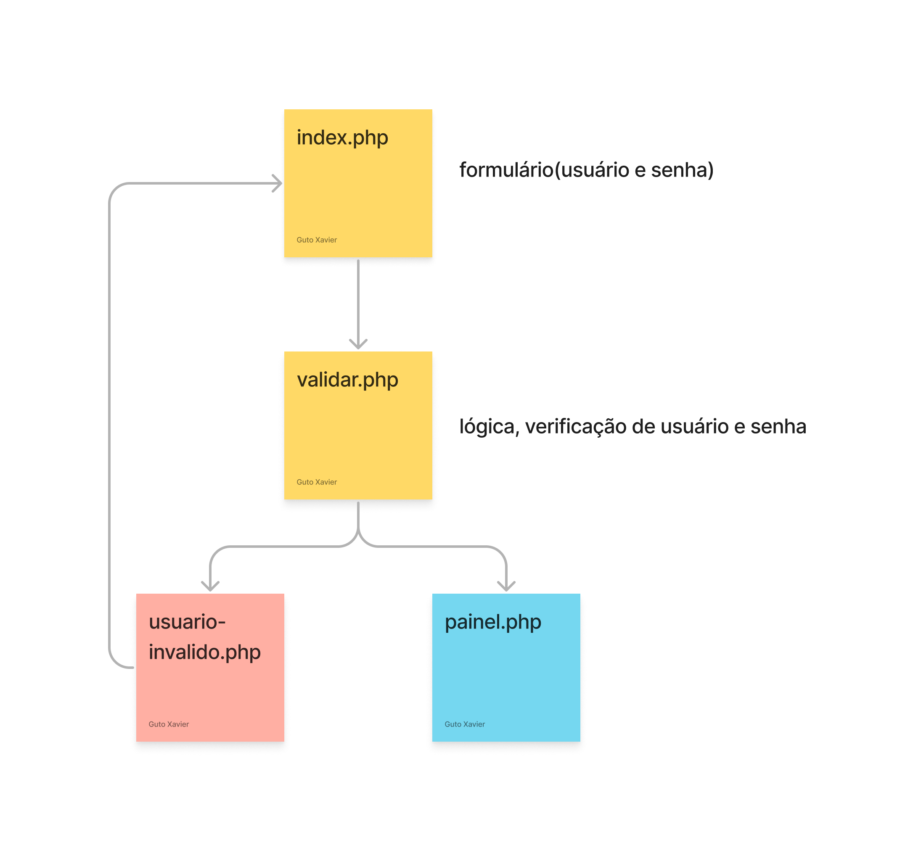

# Aula 02
- Envio de informações para o PHP
- Operadores relacionais
- Operadores Lógicos
- Estrutura de decisão
- Redirecionamento de página

Esses conteúdos seram apresentados através da criação de um sistema de login. Você pode conferir o diagrama de login em: https://www.figma.com/file/dWjiex8oMIPVcRhzLiQmOV/login-php?node-id=0%3A1&t=YDMlm2tEaxRo2izn-1



- '' Aspa simples vai mostrar cada contenudo, concatenando junto com ".". 
- "" Ele consegue entender o código.

-Comando para o type.
https://developer.mozilla.org/en-US/docs/Web/HTML/Element/input

## Envio de informações para o PHP
- No arquivo do formulário é importante o *action* do form estar configurado para o arquivo php que irá receber as informações.
- Importante escolher entre os métados *get* e *post* qual o mais adequado para usar, lembrando que:
    - get: envia as informações na url
    - post: envia as informações de forma oculta
```html
<form action="validar.php" method="post">
    Usuário:<input name="usuario"><br>
    Senha:<input nome="senha" type="password"><br>
    <button type="submit">Entrar</button>
    <button type="reset">Limpar</button>
</form>
```
- No arquivo php que vai receber as informações, você precisa utilizar o método **$_POST[]** ou **$_GET[]** em conjunto com o *name* do campo que você deseja recuperar a informação. Exemplo:
```php
$usuario = $_POST['usuario'];
$senha = $_POST['senha'];

echo "$usuario - $senha";
``` 